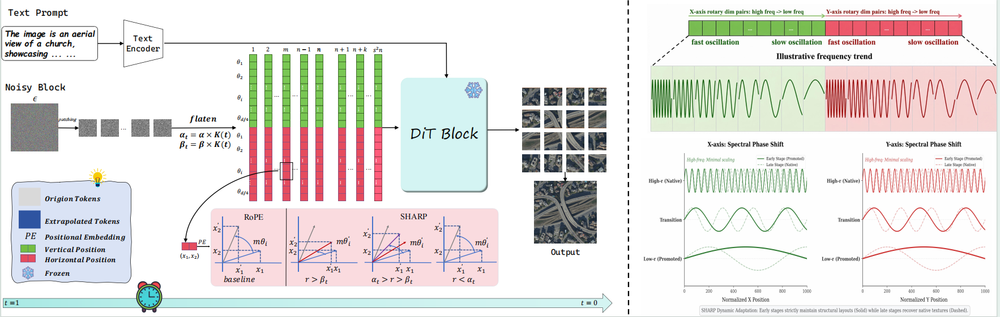

<div align="center">


# **SHARP**

### *Spectrum-aware Highly-dynamic Adaptation for Resolution Promotion in Remote Sensing Synthesis*

<p>
<em>Training-free large-scale remote sensing text-to-image synthesis with an RS-adapted FLUX prior and dynamic positional adaptation.</em>
</p>

<p>
<a href="https://huggingface.co/BxuanZ/FLUX-RS"></a>


</p>

</div>

## 🌍 Overview

SHARP is a **training-free resolution promotion framework** for remote sensing text-to-image synthesis. Built on top of an **RS-adapted FLUX prior**, it applies stronger positional extrapolation during early layout formation and progressively relaxes it during late detail recovery, enabling robust large-scale generation while preserving the dense high-frequency structures that are especially important in remote sensing imagery.

> In short: SHARP helps generate sharper, larger, and more structure-faithful remote sensing images without extra training.

The fine-tuned checkpoint is available at: **[BxuanZ/FLUX-RS](https://huggingface.co/BxuanZ/FLUX-RS)**

## 🔥 Highlights

- ✨ **Training-free** resolution promotion for remote sensing image synthesis
- 🛰️ **Spectrum-aware dynamic positional adaptation** aligned with diffusion denoising
- 📐 **Resolution-agnostic generation** across square and rectangular high resolutions
- ⚡ **FLUX-based implementation** powered by an RS-specialized generative prior
- 🧩 **Single-GPU and multi-GPU entry points** for both quick demos and batch evaluation

## 🖼️ Method Snapshot

The figure below gives a quick look at the SHARP framework and its design intuition:



## 📢 Current Status

- ✅ SHARP inference code
- ✅ Fine-tuned RS-FLUX weights
- ❌ Training data

## 🧭 Repository Map

<details>
<summary>Click to expand the project layout</summary>

```text
SHARP/
├── assets/
│   └── logo.png
├── checkpoints/
│   └── .gitkeep
├── docs/
│   └── structure.png
├── flux/
│   ├── pipeline_flux.py
│   └── transformer_flux.py
├── LICENSE
├── README.md
├── requirements.txt
├── rs_t2i_eval_prompts_100.txt
├── run_sharp.py
├── run_sharp.sh
└── run_sharp_multi_gpu.py
```

</details>

## 📦 What Is Included

| File | Description |
| :-- | :-- |
| `run_sharp.py` | Official SHARP single-GPU generation entry |
| `run_sharp_multi_gpu.py` | Multi-GPU batch launcher for multi-scale generation |
| `run_sharp.sh` | Thin shell wrapper around `run_sharp.py` |
| `flux/pipeline_flux.py` | SHARP pipeline implementation |
| `flux/transformer_flux.py` | SHARP transformer with dynamic positional adaptation |
| `rs_t2i_eval_prompts_100.txt` | Example prompt list for quick evaluation |
| `checkpoints/` | Default place for storing local checkpoints |

## 🛠 Installation

### 1. Create the environment

```bash
conda create -n sharp python=3.10
conda activate sharp
```

### 2. Install dependencies

```bash
pip install -r requirements.txt
```

### 3. Main dependencies

```text
torch
torchvision
diffusers
transformers
accelerate
sentencepiece
```

## 📥 Checkpoints

The recommended checkpoint is the RS-adapted FLUX model hosted on Hugging Face:

- `FLUX-RS`: [https://huggingface.co/BxuanZ/FLUX-RS](https://huggingface.co/BxuanZ/FLUX-RS)

By default, SHARP looks for checkpoints under:

```text
checkpoints/
```

You can use either workflow below:

- Place the downloaded `FLUX-RS` model directory under `checkpoints/`, then run SHARP without changing `--ckpt_path`
- Pass the checkpoint directory explicitly with `--ckpt_path /path/to/your_checkpoint_dir`

A valid checkpoint directory should contain a `transformer/` subfolder, for example:

```text
checkpoints/<your_checkpoint_dir>/
```

## 🚀 Quick Start

### 1. Generate from a single prompt

```bash
bash run_sharp.sh \
  --prompt "A satellite image of a rural market town with dense shop blocks, a bus station, surrounding crop fields, narrow feeder roads, and mixed residential and commercial parcels." \
  --width 1024 \
  --height 1024
```

### 2. Generate from a prompt file

```bash
python run_sharp.py \
  --prompt_file rs_t2i_eval_prompts_100.txt \
  --width 1024 \
  --height 1536 \
  --ckpt_path checkpoints/<your_checkpoint_dir> \
  --save_prefix sharp_eval \
  --out_dir sharp_outputs
```

### 3. Launch multi-GPU evaluation

```bash
python run_sharp_multi_gpu.py \
  --gpus 0 1 2 \
  --prompt_file rs_t2i_eval_prompts_100.txt \
  --ckpt_path checkpoints/<your_checkpoint_dir> \
  --scales 1024x1024 1764x1764 1024x1536 1920x1024
```

## ⚙️ Helpful Notes

- SHARP uses **one fixed inference path**, so no method switch is needed.
- The default single-GPU output directory is `sharp_outputs/`.
- The default multi-GPU output directory is `sharp_outputs_eval/`.
- `run_sharp_multi_gpu.py` will auto-detect GPUs when `--gpus` is not provided.
- If `--ckpt_path` points to `checkpoints/`, SHARP can auto-discover the model only when **exactly one** valid checkpoint directory exists there.
- For FLUX latent packing, image sizes are ideally divisible by `16`. Otherwise, the effective generated size may be rounded down internally.
- `--skip_existing` is useful for resuming long batch jobs without re-generating finished outputs.

## 🧪 Script Entry Points

```bash
bash run_sharp.sh
python run_sharp.py --help
python run_sharp_multi_gpu.py --help
```

These entry points were sanity-checked with `--help`.

## 🙏 Acknowledgement

SHARP is built on an RS-adapted FLUX prior and includes custom remote sensing generation utilities for practical large-resolution synthesis.

## 📌 License

This project is released under the [MIT License](LICENSE).
